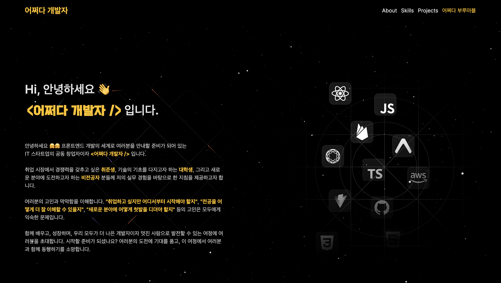
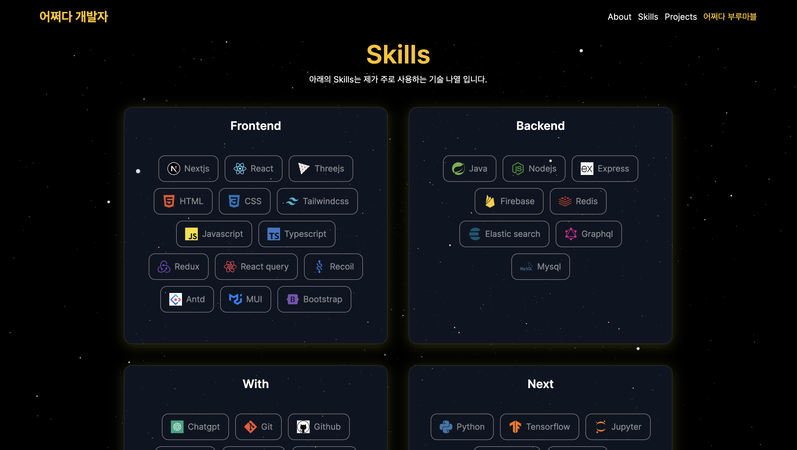
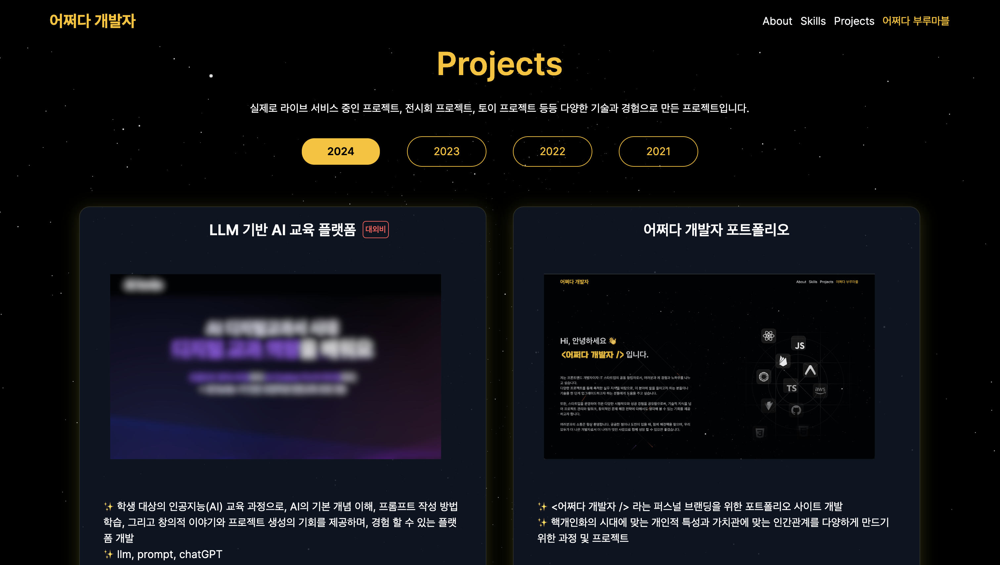
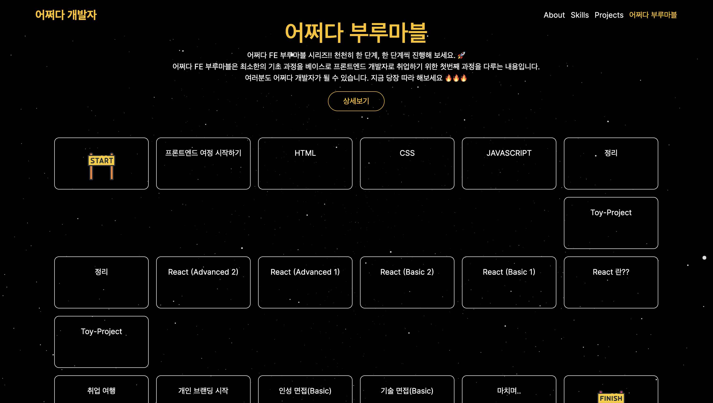

# 어쩌다 개발자 포트폴리오

## 실행 화면

  

## 인사말

안녕하세요, 여러분의 여정을 함께할 '어쩌다 개발자'입니다. 👋✨ 
한때 코드란 나와 닿지 않던 단어였습니다. 하지만, 어쩌다 한 줄, 어쩌다 한 페이지로 시작해 이제는 여러분과 이야기를 나누고 있네요. 
여기, 저의 디지털 정원에서, 저는 개발자로서의 희노애락을 여러분과 나누고 싶습니다.  

## 초보 개발자를 위한 나침반 🧭✨

'어디서부터 시작해야 하지?' - 프론트엔드 개발의 첫걸음이 두렵지만 설레는 질문입니다.  
더 이상 막연하지 않게, 당신의 개발 여정에 지도가 되어드리겠습니다.

### 첫걸음 뗄 때 🚀✨

- **기초부터 튼튼히**: HTML, CSS는 웹의 스켈레톤입니다. 여기서부터 당신의 웹 개발 여정을 시작해 보세요.
- **JavaScript로 마법 부리기**: 이 언어 없이 웹은 단순한 문서에 불과합니다. JavaScript로 웹에 생명을 불어넣어보세요.
- **React로 차원을 달리하기**: 현대의 프론트엔드 개발에서 React는 단순한 라이브러리를 넘어서, 당신이 만들 세계를 구현하는 도구입니다.
- **그리고 더 많은 것들**: 저와 함께 단계별로 배워나가 보실까요?

### 실습으로 배우기 🔥✨

- **함께하는 프로젝트**: 간단한 웹사이트부터 시작해 복잡한 애플리케이션까지, 실습을 통해 배운 것을 프로젝트하여 관리해 보아요.
- **포트폴리오 구축**: 여러분이 직접 작성한 코드와 프로젝트를 정리하여 포트폴리오로 같이 만들어 보아요.
- **기술 면접 준비**: 기술 면접에서 자주 물어보는 질문들과 그에 대한 답변 준비법을 공유해 보아요.
- **취업 준비**: 많은 면접 경험과 면접관 경험 두 경험을 토대로 여러분에게 많은 정보를 제공 할 수 있을 것 같아요.  결국 우리의 목표는!!! 취뽀🌟✨⭐️🪐🌈🔥!!  

## 함께 해요, '어쩌다 개발자' 🌐✨

여러분이 혼자 고민하지 않도록, '어쩌다 개발자'는 항상 여러분 곁에 있습니다.  
저도 처음 하는 분야이기 때문에 많이 서툴고 완벽하진 않지만.. 제가 가장 중요하게 생각하는 것이   바로!! "아이디어는 내면에서 끓어 오르는 생각에 불과하다" 입니다. 성공은 아이디어가 아닌 실행에 달려 있는거죠. 하나씩 차근차근 함께 만들어 가보아요!🌟✨
